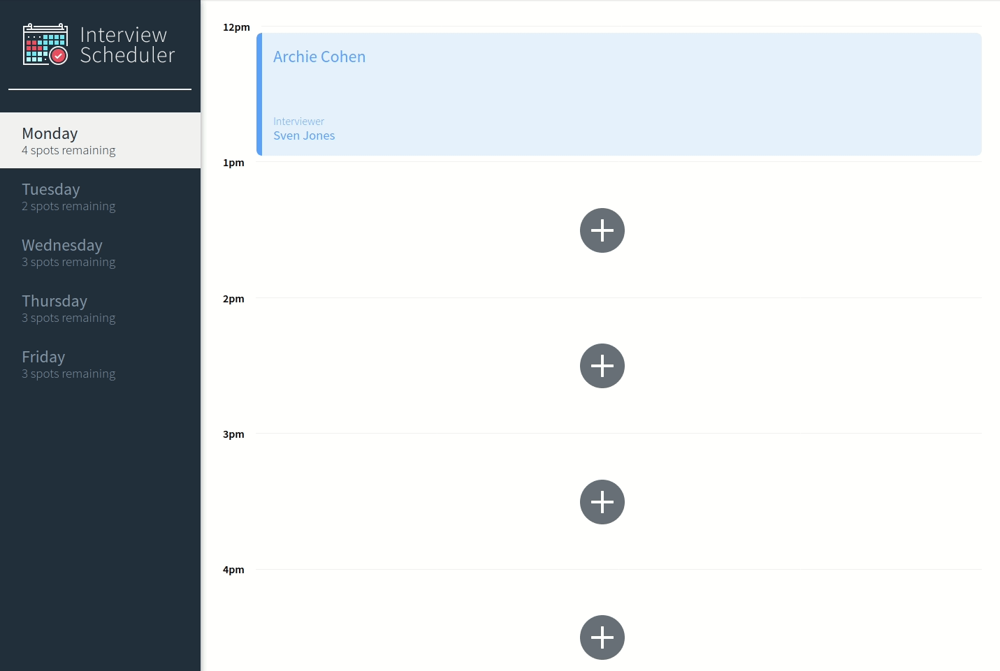
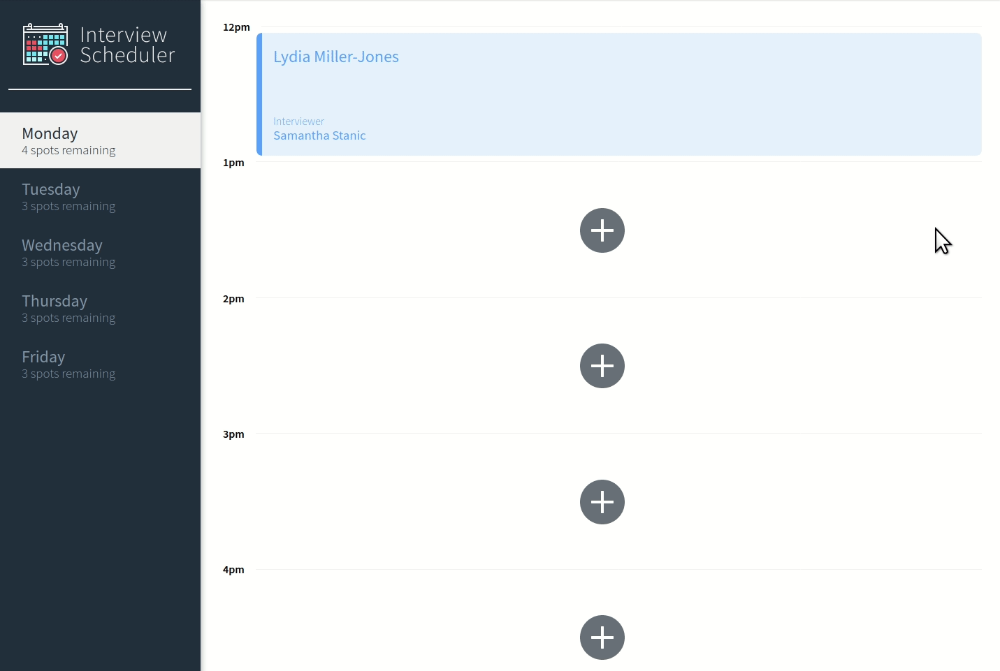

# Interview Scheduler

[](https://circleci.com/gh/thelittleblacksmith/scheduler)

A single page application made with React and PostgreSQL where users can book an appointment with listed interviewers.

- Live: https://blissful-jackson-ea69c2.netlify.com/
- Example API endpoint: https://lhl-react-scheduler.herokuapp.com/api/days

## Preview

Navigating between weekdays


Editing and deleting appoitnments


Error handling when creating and deleting appointments


## Setup

1. Follow [Scheduler API](https://github.com/lighthouse-labs/scheduler-api)'s readme to setup the API Server.
1. Install dependencies with `npm install`.

## Running Webpack Development Server

```sh
npm start
```

## Running Jest Test Framework

```sh
npm test
```

## Running Storybook Visual Testbed

```sh
npm run storybook
```

## Running Cypress

**Note:** Please install Cypress globally if you'd like to run this command.

```sh
npm run cypress
```
